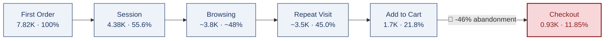
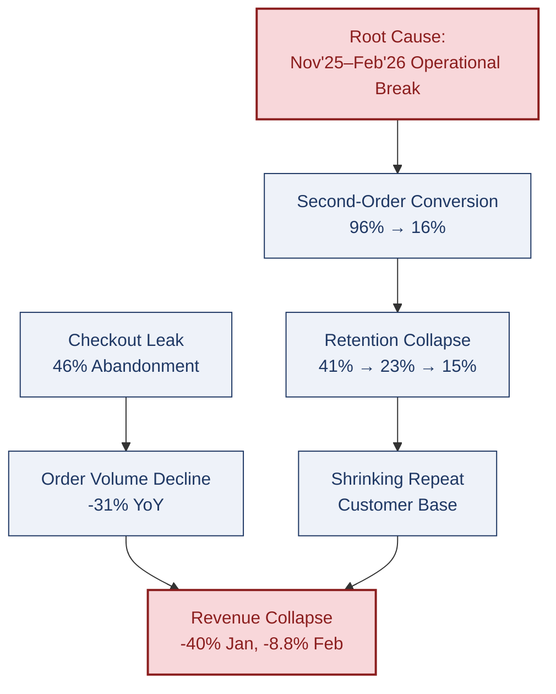

# 🚀 E-Commerce Customer Retention & Growth Analysis
### Senior Analyst Findings Report | Databricks + Spark SQL + Python + Power BI

<p align="center">
  
</p>

<p align="center">
  
  
  
  
  
</p>

---

## 📑 Table of Contents
[TL;DR](#-tldr--severity-snapshot) · [Objective](#-business-objective) · [Where Value Leaks](#-where-value-leaks-the-funnel-map) · [Deep Analysis](#-deep-analysis-whatwhyactionrisk) · [Root Cause Map](#-root-cause-map-how-the-findings-connect) · [Priority Matrix](#-recommendation-priority-matrix) · [Expected Impact](#-expected-business-impact) · [Dashboard Preview](#-dashboard-preview) · [Author](#-author)

---

## ⚡ TL;DR — Severity Snapshot

| Finding | Severity | Impact in One Line |
|---|---|---|
| 1. Revenue & order collapse at year-end | 


 | Revenue -40% (Jan), -8.8% (Feb) — steepest 2-month drop in the dataset |
| 2. Second-order conversion collapse | 


 | 96% → 16% in under a year |
| 3. Checkout is the biggest funnel leak | 


 | 46% abandon between cart and checkout |
| 4. Retention falls off a cliff after Month 1 | 


 | 41% → 23% → ~15% (Month 1 → 3 → 6) |
| 5. Budget doesn't match channel efficiency | 


 | Best channel (LTV:CAC 8.5) isn't top-funded |
| 6. Growth bought via discounting, not earned | 


 | 63% of sales discounted; new products = 32% of sales |

---

## 🎯 Business Objective

> To diagnose why revenue fell sharply in the final two months of the year despite continued marketing spend and heavy discounting, and to pinpoint exactly where value is leaking across the acquisition-to-retention journey — so first-time buyers convert into a sustainably repeating, profitable customer base.

**Executive Summary:** The business does not have a demand-generation problem. It has a leakage problem concentrated in three places — checkout completion, second-order conversion, and post-Month-1 retention — and that leakage compounded sharply at year-end, when revenue, order volume, and acquisition all declined together.

---

## 🗺️ Where Value Leaks: The Funnel Map



The steepest single-step loss in the entire journey isn't at the top — it's the last five feet before payment.

---

## 🔬 Deep Analysis (What / Why / Action / Risk)

<details open>
<summary><b>1️⃣ Revenue and Order Volume Collapsed Together at Year-End</b> &nbsp; 


</summary>

| | |
|---|---|
| 📌 **WHAT** | Revenue fell ~40% in January and a further ~8.8% in February — the steepest two-month decline in the 12-month dataset. In the same window: Total Orders fell 31% (2,565 → 1,767/month), acquisition fell 30% (1,975 → 1,377/month), delivered orders fell 33% (2,322 → 1,544/month). |
| 🎯 **WHY** | Four independent metrics moved down together in the same window — one shared cause (marketing pull-back, stock/catalog gap, pricing change, or platform issue), not four unrelated problems needing separate fixes. |
| 🛠️ **ACTION** | Run a single root-cause investigation covering marketing spend timing, stock availability, and platform/checkout changes made Nov 2025–Feb 2026 — before authorizing new spend to reverse the trend. |
| ⚠️ **RISK** | If the root cause isn't identified, any fix is a guess. Increasing spend or discounting to compensate could mask the real issue and let it recur in the next low-volume window. |

</details>

<details>
<summary><b>2️⃣ Second-Order Conversion Has Collapsed</b> &nbsp; 


</summary>

| | |
|---|---|
| 📌 **WHAT** | Second-order conversion fell from 96% (Mar 2025) to 16% (Feb 2026). The dashboard's all-time average (83.29%) conceals this — a historical average sitting on top of a badly deteriorating recent trend. |
| 🎯 **WHY** | A drop this steep and fast is inconsistent with gradual demand softening — far more consistent with an operational break in the post-purchase journey (notification/CRM failure, app defect, or fulfillment issue) starting ~Nov 2025. |
| 🛠️ **ACTION** | Root-cause the break specifically in Nov 2025–Feb 2026 cohorts: audit notification delivery, app stability logs, and post-delivery experience for that window. |
| ⚠️ **RISK** | Second purchases are the foundation of Month 1/3 retention and LTV. Left unaddressed, every acquisition rupee increasingly buys a one-time customer instead of a repeat one — compounding Finding 1. |

</details>

<details>
<summary><b>3️⃣ Checkout Is the Single Largest Leak in the Funnel</b> &nbsp; 


</summary>

| | |
|---|---|
| 📌 **WHAT** | 21.83% of activated users add to cart, but only 11.85% complete checkout — a ~46% last-mile abandonment. The steepest single-step drop anywhere in the funnel. |
| 🎯 **WHY** | Concentrated at the final step, with Credit Card/UPI/Wallet already dominant payment methods — points to a checkout-specific issue (UX friction, trust signal, or cost surprise) rather than a traffic-quality problem upstream. |
| 🛠️ **ACTION** | Audit checkout specifically: payment failure rates, hidden fees, forced account creation, page load time. Prioritize ahead of upper-funnel work — it caps the return on every stage above it. |
| ⚠️ **RISK** | Optimizing earlier funnel stages first improves top-of-funnel metrics without moving revenue, because the checkout ceiling stays the same. |

</details>

<details>
<summary><b>4️⃣ Retention Falls Off a Cliff After Month 1</b> &nbsp; 


</summary>

| | |
|---|---|
| 📌 **WHAT** | 40.65% retained at Month 1, dropping to 23.38% by Month 3 and ~14.68% by Month 6. Cohort repeat rates have drifted from the mid-40s (early 2025) to the mid-30s (late 2025). |
| 🎯 **WHY** | Most repeat purchases happen within an 8–30 day window (avg. time to second order: 48 days) — a defined, short, currently under-utilized window with the highest leverage in the lifecycle. |
| 🛠️ **ACTION** | Launch a structured Day 8 / 20 / 30 lifecycle campaign (email, push, targeted offer) aimed at that window; measure against the 45–48% Month 1 retention seen in earlier cohorts. |
| ⚠️ **RISK** | Without intervention, retention keeps compressing toward the ~15% Month 6 floor already visible — shrinking the repeat-customer base that funds LTV. |

</details>

<details>
<summary><b>5️⃣ Acquisition Budget Doesn't Match Channel Efficiency</b> &nbsp; 


</summary>

| | |
|---|---|
| 📌 **WHAT** | Referral has the best LTV:CAC of any channel (8.5, CAC ₹53, LTV ₹452) but isn't the top-funded channel — Organic is (22.4% of spend). Email + Influencer (weakest, 4.3–4.4) absorb 36% of the ₹471.1K budget. |
| 🎯 **WHY** | Budget allocation tracks historical spend patterns rather than current return — the highest-ROI channel is under-funded. |
| 🛠️ **ACTION** | Reallocate 15–20% of combined Email/Influencer spend into Referral (e.g., a structured incentive program); track whether the LTV:CAC ratio holds at higher volume. |
| ⚠️ **RISK** | Referral efficiency may not scale linearly — pushing more budget in could raise its CAC as the channel saturates. Reallocate incrementally, not all at once. |

</details>

<details>
<summary><b>6️⃣ Growth Is Increasingly Bought Through Discounting, Not Earned</b> &nbsp; 


</summary>

| | |
|---|---|
| 📌 **WHAT** | 62.65% of Gross Product Sales are discounted, spread almost evenly across every category. New products generate only 32% of sales vs. 68% from the old catalogue. |
| 🎯 **WHY** | Blanket discounting compresses margin on customers who'd have converted at full price anyway; an aging product mix suggests new SKUs lack visibility. |
| 🛠️ **ACTION** | Move to segment-targeted discounting (protect margin on High/Very-High LTV, focus offers on Low Value); separately audit new-product placement, search ranking, and promotion. |
| ⚠️ **RISK** | Pulling discounts without segmenting first could suppress conversion further while volume is already declining. Test on a subset of categories first. |

</details>

---

## 🕸️ Root Cause Map: How the Findings Connect



This is the core insight of the whole analysis: these are not six separate problems. Checkout friction and the second-order break are two independent leaks that both drain into the same revenue collapse.

---

## 🏆 Recommendation Priority Matrix

| Priority | Recommendation | Impact | Effort |
|---|---|---|---|
| 🥇 **P0 — Do First** | Fix the cart-to-checkout drop-off | High | Low |
| 🥇 **P0 — Do First** | Investigate the Jan–Feb revenue/order collapse | High | Medium |
| 🥈 **P1 — Do Next** | Root-cause the second-order conversion break | High | Medium |
| 🥈 **P1 — Do Next** | Launch the Day 8/20/30 lifecycle campaign | Medium | Low |
| 🥉 **P2 — Plan** | Reallocate budget toward Referral | Medium | Low |
| 🥉 **P2 — Plan** | Move to segment-targeted discounting | Medium | Medium |
| 🏅 **P3 — Longer-Term** | Improve new-product visibility & promotion | Low–Medium | Medium |

---

## 📈 Expected Business Impact

| KPI | Current | Target |
|---|---|---|
| Revenue MoM Movement | -40% (Jan), -8.8% (Feb) | Stabilize / positive |
| Second-Order Conversion (recent) | ~16% | 50%+ |
| Checkout Completion Rate | 11.85% | 15%+ |
| Month 1 Retention | 40.65% | 45–48% |
| Discounted Sales Share | 62.65% | 45–50% |
| New Product Sales Share | 32% | 40%+ |

*Targets are directional, derived from ratios and volumes in the dashboard — meant to prioritize action, not substitute for A/B testing before use in budgeting.*

---

## 🛠 Tech Stack

| Tool | Purpose |
|---|---|
| Databricks (Spark SQL) | Large-scale processing & analytical querying |
| Python (Pandas, NumPy) | Data cleaning & feature engineering |
| Power BI + DAX | Dashboarding, KPI logic, time intelligence |
| Star Schema Modeling | Bronze → Silver → Gold architecture |

```
Raw Data → Python Cleaning → Databricks (Spark SQL) → Gold-Layer Tables → Power BI Dashboard
```

---

## 📊 Dashboard Preview

<details>
<summary><b>🔹 Executive Overview</b></summary>
<p align="center"></p>
</details>

<details>
<summary><b>🔹 Acquisition & Channel Performance</b></summary>
<p align="center"></p>
</details>

<details>
<summary><b>🔹 Customer Lifecycle</b></summary>
<p align="center"></p>
</details>

<details>
<summary><b>🔹 Retention Analysis</b></summary>
<p align="center"></p>
</details>

<details>
<summary><b>🔹 Activation Funnel</b></summary>
<p align="center"></p>
</details>

<details>
<summary><b>🔹 Product & Category Performance</b></summary>
<p align="center"></p>
</details>

<details>
<summary><b>🔹 Returns & Refund Analysis</b></summary>
<p align="center"></p>
</details>

---

## 👨‍💻 Author

**Ankit Kumar**
Data Analyst | Product Analytics | SQL | Power BI | Python | Databricks

- GitHub: https://github.com/ankitkumargaya
- LinkedIn: https://www.linkedin.com/in/ankit5517

---

## 📌 Bottom Line

> The business does not have a demand problem — it has a leakage problem, concentrated at checkout, in the second-purchase journey, and in the window immediately following a customer's first order. That leakage accelerated sharply at year-end. Fixing even two or three of the findings above — starting with the checkout leak and the root-cause investigation into the year-end collapse — should move the business from a declining revenue trend toward genuine, compounding growth.

### Acquisition-Led, Discount-Dependent Growth → Retention-Led, Sustainable Growth
