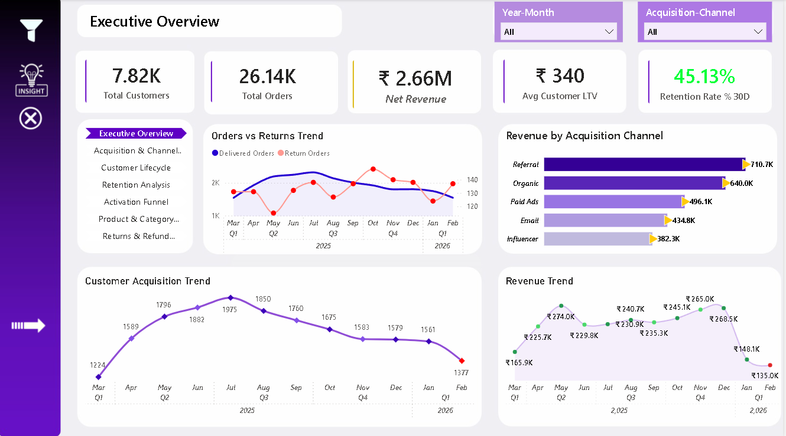
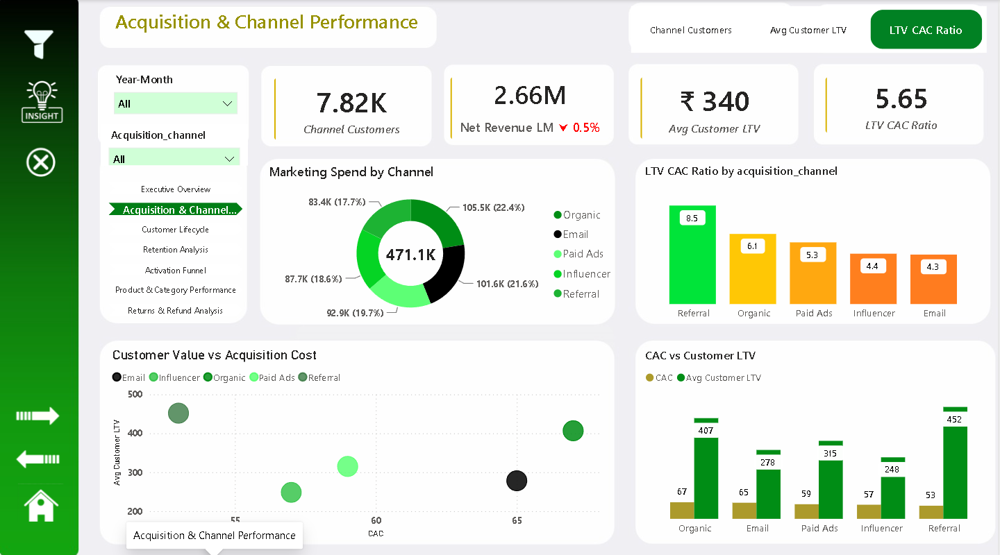
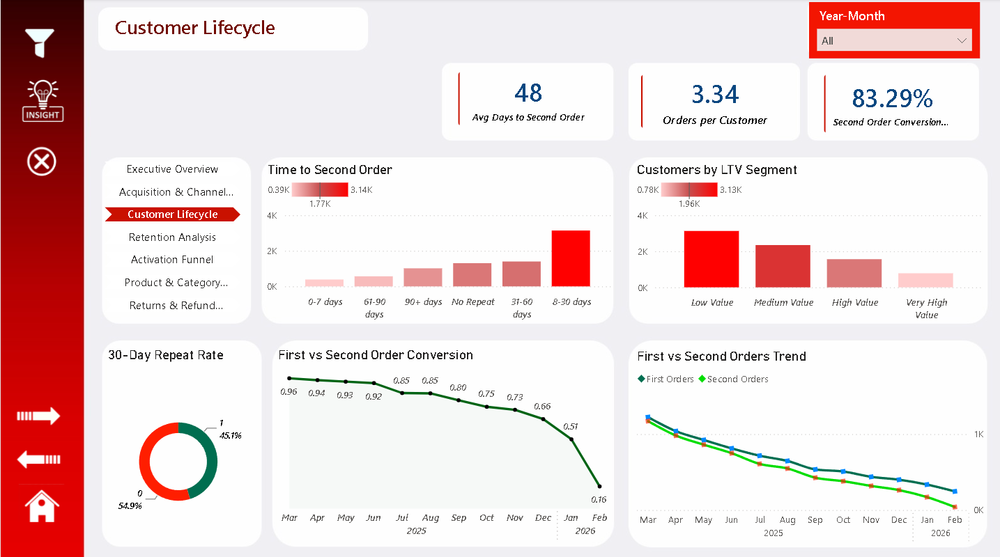
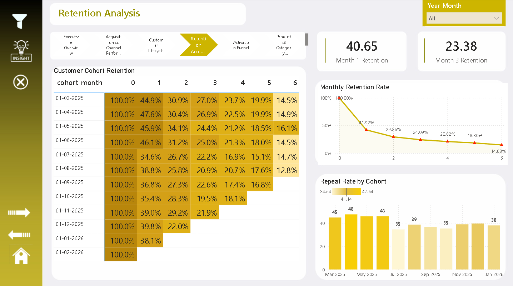
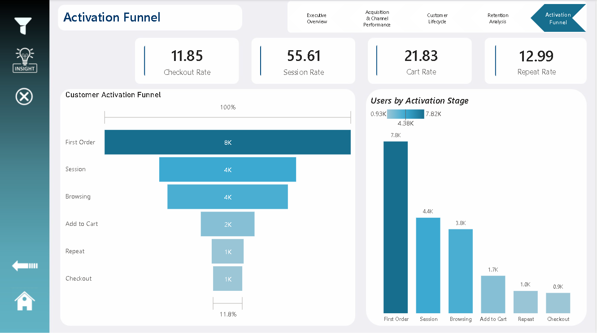
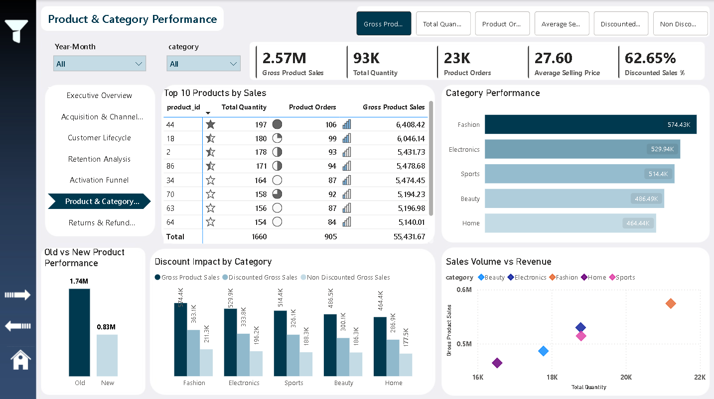
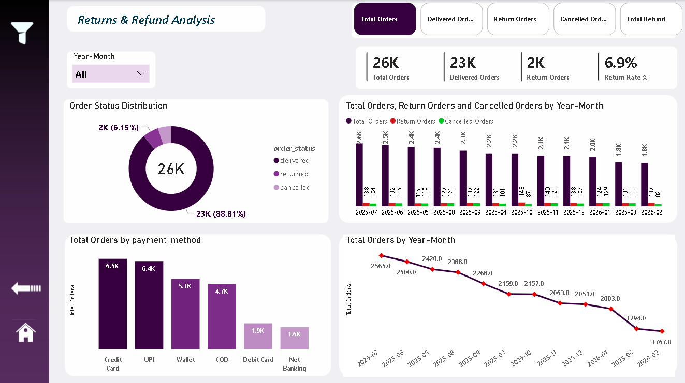

# 🚀 E-Commerce Customer Retention & Growth Analysis
### End-to-End Product Analytics Case Study | Databricks + Spark SQL + Python + Power BI

  

---

## 📌 Project Overview

A complete, end-to-end **product analytics and customer retention case study** built on a Bronze → Silver → Gold data architecture, covering the full customer journey from **acquisition → activation → checkout → repeat purchase → returns**.

This version extends the original analysis with **full product-level and returns-level data**, which surfaced a sharper and more accurate diagnosis of the business's growth problem than the earlier draft.

Simulates a real-world analytics environment used by modern product and e-commerce companies such as Amazon, Flipkart, Meesho, Zepto, Blinkit, and Swiggy Instamart.

---

## 🎯 Business Objective

> To diagnose why revenue fell sharply in the final two months of the year despite continued marketing spend and heavy discounting — by tracing the full customer journey from acquisition to repeat purchase to pinpoint exactly where value was leaking, and recommend the levers to convert first-time buyers into a sustainably repeating, profitable customer base.

**Key reframe from the original analysis:** the business does not have an acquisition problem — it has a **repeat-purchase and revenue-leakage problem**, and that leakage accelerated sharply at the end of the year.

---

## 🔍 Key Insights at a Glance

| # | Insight | Signal |
|---|---|---|
| 1 | Revenue fell sharply in the final two months of the year | Down ~40% in January and a further ~8.8% in February — the steepest two-month decline in the dataset |
| 2 | The customer engine underneath is shrinking too | Acquisition down 30% (1,975 → 1,377/month); delivered orders down 33% (2,322 → 1,544/month); Total Orders down 31% (2,565 → 1,767/month) |
| 3 | Repeat-purchase behavior has collapsed | Second-order conversion fell from **96% → 16%** in under a year — the sharpest signal in the dataset |
| 4 | Retention falls off a cliff after Month 1 | 41% at Month 1 → 23% by Month 3 → ~15% by Month 6 |
| 5 | The funnel bleeds hardest at the finish line | Cart rate 21.8% but checkout completion only 11.9% — a **~46% last-mile drop-off** |
| 6 | Acquisition budget doesn't follow efficiency | Referral has the best LTV:CAC (8.5) but isn't the top-funded channel |
| 7 | Growth is being bought, not earned | **63% of product sales are discounted**; new products are only 32% of sales vs. 68% from the old catalogue |

---

## 🛠 Tech Stack

| Tool / Technology | Purpose |
|---|---|
| Databricks (Spark SQL) | Large-scale data processing & analytical querying |
| SQL | KPI validation & business analysis |
| Python (Pandas, NumPy) | Data cleaning & feature engineering |
| Power BI | Dashboard development & visualization |
| DAX | KPI calculations & time intelligence |
| Power Query | Data transformation |
| Star Schema Modeling | Scalable analytics architecture |

---

## ⚙️ Data Processing & Analytics Workflow
Raw Data → Python Cleaning → Databricks Processing (Spark SQL) → Analytical Tables → Power BI Dashboard

### Spark SQL Analysis Included
- Funnel analysis
- Retention & cohort analysis
- Customer lifecycle analysis
- Channel performance analysis (LTV/CAC)
- Repeat purchase analysis
- Product & category performance
- Returns & refund analysis
- Revenue trend analysis

---

## 🧱 Data Architecture (Bronze → Silver → Gold)

### 🥉 Bronze Layer
Raw source datasets from transactional systems.

### 🥈 Silver Layer — Core Tables

| Table Name | Description |
|---|---|
| customers | Customer details & acquisition channel |
| sessions | User engagement & activity |
| orders | Order-level transactions |
| order_items | Product-level order breakdown |
| returns | Return & refund behavior |
| marketing_events | Campaign interaction tracking |
| marketing_spend | Channel-level acquisition cost |

### 🥇 Gold Layer — Business-Ready Tables

| Table | Tracks |
|---|---|
| `activation_funnel` | Session → Browsing → Cart → Checkout → Repeat, with stage-wise drop-offs |
| `customer_lifecycle` | First/second order date, days to second purchase, repeat flags |
| `retention_cohort` | Monthly cohort size, retained users, retention % |
| `channel_ltv` | Customers acquired, revenue, LTV, CAC, LTV:CAC ratio |
| `product_performance` | Product/category sales, quantity, discount impact, old vs. new SKUs |
| `returns_refunds` | Order status distribution, return rate, refund value |

---

## 🧠 Analytical Approach

| Growth Layer | Business Focus |
|---|---|
| Acquisition | Channel quality & efficiency (LTV:CAC) |
| Activation | Session → cart → checkout conversion |
| Conversion | Funnel performance & drop-off analysis |
| Retention | Cohort retention & repeat-purchase behavior |
| Monetization | LTV, CAC, discount dependency, revenue efficiency |
| Product | Category performance, old vs. new product mix |
| Post-Purchase | Returns, refunds, order fulfillment health |

---

## 📊 Key Analysis Performed

**Customer Acquisition** — channel-wise CAC, LTV:CAC ranking, spend allocation vs. efficiency
**Customer Lifecycle** — time to second purchase, repeat behavior, LTV segmentation
**Retention** — monthly cohort retention, early-stage churn, cohort-over-cohort trend
**Activation Funnel** — session → browsing → cart → checkout, stage-wise drop-off
**Product & Category** — top products, category performance, discount impact, old vs. new SKU sales
**Returns & Refunds** — order status distribution, return rate, order volume trend

---

## 🔎 Detailed Key Insights

### 1️⃣ Revenue Fell Sharply in the Final Two Months of the Year
After holding in the ₹225–274K range for most of the year, revenue dropped to **₹148.1K in January (~40% decline)** and fell further to **₹135.0K in February (~8.8% decline)** — the steepest two-month slide in the entire dataset. This lines up with a parallel drop in order volume: Total Orders fell from roughly **2,565 → 1,767/month (-31%)** over the year, alongside a 30% decline in acquisition and a 33% decline in delivered orders. Revenue, orders, delivered volume, and acquisition are all contracting together in the same window — a single, coordinated slowdown rather than four unrelated symptoms.

### 2️⃣ Acquisition Budget Doesn't Follow Efficiency
**Referral** delivers the best return of any channel (LTV:CAC **8.5**, CAC ₹53, LTV ₹452) but isn't the top-funded channel — **Organic** is. Email and Influencer, the two weakest channels (LTV:CAC 4.3 and 4.4), together absorb **36% of the ₹471K acquisition budget**.

### 3️⃣ The Activation Funnel Leaks Hardest at the Finish Line
Of every ~7.8K activated users, only **11.85%** complete checkout, even though **21.83%** add to cart — a **~46% last-mile abandonment** right before payment. This is a checkout UX/trust issue, not a payment-options issue.

### 4️⃣ Repeat-Purchase Behavior Is Breaking Down
The all-time Second-Order Conversion average (83.29%) hides a collapse: the monthly trend fell from **96% (Mar 2025) to 16% (Feb 2026)** — too sharp to be gradual demand softening, and more likely an operational break in the post-purchase journey. Month 1 retention (40.65%) drops to Month 3 (23.38%), and cohort repeat rates have structurally declined from the mid-40s to the mid-30s over the year.

### 5️⃣ Revenue Is Increasingly Discount-Dependent
**62.65%** of Gross Product Sales are discounted, spread almost evenly across every category — a blanket strategy, not a targeted one, and part of what's propping up revenue even as it slides.

### 6️⃣ New Products Are Underperforming; Returns Are the Smaller Problem
New products generate only **32%** of sales vs. **68%** from the old catalogue. Returns are healthy at a **6.9%** return rate — the real problem is upstream: order volume itself is shrinking.

---

## 💣 Root Cause Analysis

> The business does not have a demand or acquisition problem — it has a **leakage problem that accelerated sharply at year-end**. Value is lost at three specific points: the checkout step, the post-first-purchase engagement window, and an unexplained operational break in second-order conversion starting around November 2025 — all converging with the revenue and order-volume collapse in January–February.

---

## 🚀 Strategic Recommendations

| # | Recommendation | Why It Matters | Expected Impact |
|---|---|---|---|
| 1 | Investigate the Jan–Feb revenue and order collapse as one connected event | Revenue (-40% then -8.8%), Total Orders (-31% over the year), delivered orders, and acquisition all decline together in the same window | A single root-cause investigation is more likely to find the real driver than treating each metric's decline separately — and whatever caused it should be reversible if identified |
| 2 | Fix the cart-to-checkout drop-off | 46% of cart users abandon before payment | Est. 200–250 additional completed orders per cycle, zero added acquisition spend |
| 3 | Reallocate 15–20% of Email + Influencer budget into Referral | Referral's LTV:CAC (8.5) is ~2x Email's (4.3) | Higher LTV generated per rupee of acquisition spend |
| 4 | Root-cause the Nov'25–Feb'26 second-order collapse | Sharp trend break signals an operational issue, not organic decline | Restoring even half the historical rate rebuilds the repeat-customer base |
| 5 | Launch a Day 8 / 20 / 30 lifecycle campaign | Most repeat purchases already happen in the 8–30 day window (avg. 48 days) | Should lift Month 1 retention toward the 45–48% seen in early cohorts |
| 6 | Move from blanket to segment-targeted discounting | 63% of sales discounted uniformly across categories | Protects margin on high-LTV segments without hurting conversion |
| 7 | Improve discoverability & promotion of new products | New products are 32% of sales vs. 68% for old | Grows Gross Product Sales without acquiring new customers |

---

## 📈 Expected Business Impact

| KPI | Current | Target |
|---|---|---|
| Monthly Revenue Trend | -8.8% MoM (Feb), -40% MoM (Jan) | Stabilize month-over-month movement |
| Second-Order Conversion (recent trend) | ~16% | 50%+ |
| Checkout Completion Rate | 11.85% | 15%+ |
| Month 1 Retention | 40.65% | 45–48% |
| Discounted Sales Share | 62.65% | 45–50% |
| New Product Sales Share | 32% | 40%+ |

---

## 📊 Dashboard Pages

- Executive Overview
- Acquisition & Channel Performance
- Customer Lifecycle
- Retention Analysis
- Activation Funnel
- **Product & Category Performance** *(new)*
- **Returns & Refund Analysis** *(new)*

## ⚡ Advanced Power BI Features
Dynamic KPI selection · Field parameters · Drill-down & drill-through · Interactive filters/slicers · Custom page navigation · Insight buttons · Dynamic titles · YoY/MoM analysis · Conditional formatting · Tooltip enhancements

---

## 🔑 Key Skills Demonstrated

Product Analytics · Customer Retention & Cohort Analysis · Funnel Analytics · Customer Lifecycle Analytics · Spark SQL · Databricks · Advanced SQL · Power BI Dashboarding · DAX · Data Modeling · Business Intelligence · Data Storytelling

---

## 📸 Dashboard Preview

### 🔹 Executive Overview

### 🔹 Acquisition & Channel Performance

### 🔹 Customer Lifecycle

### 🔹 Retention Analysis

### 🔹 Activation Funnel

### 🔹 Product & Category Performance

### 🔹 Returns & Refund Analysis

---

## 💼 Business Impact

This analysis helps stakeholders:
- Understand why revenue and order volume both collapsed in the same window
- Identify exactly where revenue is leaking across the funnel
- Fix the checkout step driving the largest single conversion loss
- Diagnose and reverse the second-order conversion collapse
- Reduce reliance on acquisition spend and discounting
- Shift toward a retention-led, margin-healthy growth strategy

---

## 👨‍💻 Author

**Ankit Kumar**
Data Analyst | Product Analytics | SQL | Power BI | Python | Databricks

- GitHub: https://github.com/ankitkumargaya
- LinkedIn: https://www.linkedin.com/in/ankit5517

---

## 📌 Final Conclusion

> The primary issue is not customer acquisition — it's a coordinated year-end collapse in revenue and order volume, compounded by checkout friction, a broken second-order journey, and growth that's increasingly bought through discounting rather than earned through retention.

By investigating the Jan–Feb collapse, fixing checkout, diagnosing the second-order break, and shifting spend toward the most efficient channel, the business can move from:

### Acquisition-Led, Discount-Dependent Growth → Retention-Led, Sustainable Growth
